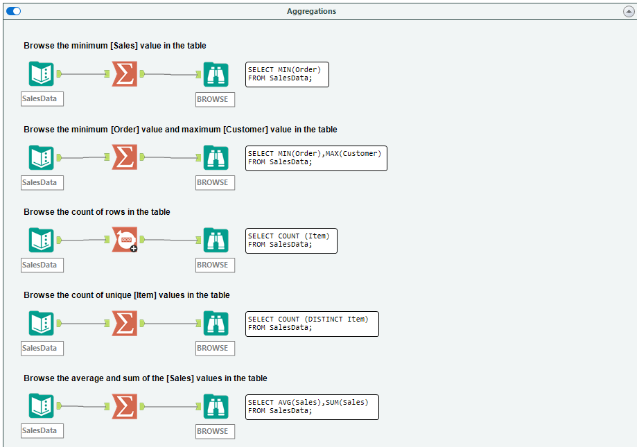
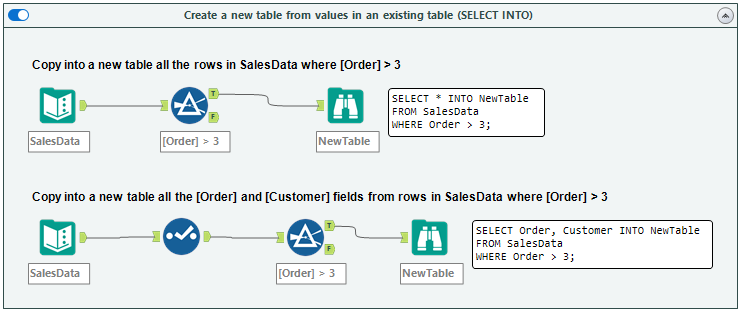

<h1>Alteryx <> Python (pandas) Translation</h1>

Inspired by the fantastic Alteryx <> SQL resource created by [Dan Farmer](https://www.linkedin.com/in/danjfarmer/)  
To be used with the provided [reference file](https://github.com/DataNath/alteryx_to_python/blob/main/alteryx_to_python.py) (credit: Dan Farmer)  
Produced by Nathan Purvis - [Databasyx](https://www.databasyx.com/) co-founder | Data Engineer @ [The Information Lab](https://www.theinformationlab.co.uk/)

<h2>Contact</h2>

[GitHub](https://github.com/DataNath) | [LinkedIn](https://www.linkedin.com/in/nathan-purvis/) | [Twitter](https://x.com/DataNath) | [Alteryx Community](https://community.alteryx.com/t5/user/viewprofilepage/user-id/307299)  
Email: Nathan@databasyx.com

<h2>What's this all about?</h2>

Many users who have predominantly used GUI-based data tools, in this case Alteryx, may have a business requirement or just generally be keen to explore code-based equivalents. Due to Python's prevalence, particularly with libraries like pandas, this seemed like a useful resource to put together. Thankfully, Dan had already produced a great asset for anyone switching between Alteryx and T-SQL. This repo uses the exact same examples and produces the same outputs.

<h2>Sections</h2>

<details>
<summary><strong style="font-size: 24px;";>Browse date with criteria (SELECT statement):</strong></summary>  

>


```
# Browse all the data in the table

sales_data = "data/SalesData.csv"

df = pd.read_csv(sales_data)

print(df)

# Browse the [Order] and [Sales] fields in the table

df1 = df[["Order", "Sales"]]

print(df1)

# Browse the [Order] and [Sales] fields in the table, and sort by [Sales] descending

df2 = df[["Order", "Sales"]].sort_values(by="Sales", ascending=False)

print(df2)

# Browse the top 2 rows of the [Order] and [Customer] fields in the table, sorted by [Sales] descending

df3 = df.sort_values(by="Sales", ascending=False).head(2)[["Order", "Customer"]]

print(df3)
```


```
# Browse the unique [Item] values in the table

sales_data_1 = "data/SalesData1.csv"

df = pd.read_csv(sales_data_1)

df4 = df[["Item"]].drop_duplicates()

print(df4)

# Browse the unique combinations of [Item] and [Customer] values in the table

df5 = df[["Item", "Customer"]].drop_duplicates()

print(df5)

# Browse all fields in rows where [Order] = 3

df6 = df[df["Order"] == 3]

print(df6)

# Browse all fields in rows where [Item] = 'pencil' AND [Sales] > 50

df7 = df[(df["Item"] == "Pencil") & (df["Sales"] > 50)]

print(df7)

# Browse all fields in rows where [Item] = 'Apple' OR [Customer] = 'Alison Angler'

df8 = df[(df["Item"] == "Apple") | (df["Customer"] == "Alison Angler")]

print(df8)
```

</details>

<details>
<summary><strong style="font-size: 24px;";>Using wildcards in SELECT statement WHERE clauses:</strong></summary>

>


```
# Browse all rows where the [Customer] field contains 'Pu'

df9 = df[df["Customer"].str.contains("Pu")]

print(df9)

# Browse all rows where the [Item] field begins with 'App'

df10 = df[df["Item"].str.startswith("App")]

print(df10)
```

</details>

<details>
<summary><strong style="font-size: 24px;";>Finding records where a field matches one of a list of values (the IN operator):</strong></summary>

>


```
# Browse all rows where the [Item] field is 'Pencil', 'Apple' or 'Orange'

df11 = df[df["Item"].isin(["Pencil", "Apple", "Orange"])]

print(df11)

# Browse all rows where the [Item] field is not 'Pencil' or 'Apple'

df12 = df[~df["Item"].isin(["Pencil", "Apple"])]

print(df12)

# Browse all rows where the [Item] field matches any values in a given field in another table

stock_data = "data/StockData.csv"

df13 = pd.read_csv(stock_data).drop_duplicates()

df14 = pd.merge(
    left=df, right=df13, how="inner", left_on="Item", right_on="ItemName"
).drop(columns="ItemName")

print(df14)
```

</details>

<details>
<summary><strong style="font-size: 24px;";>Finding records where a field is between two values (the BETWEEN operator):</strong></summary>

>


```
# Browse all rows where the [Sales] field is >= 70 and <= 90

df15 = df[df["Sales"].between(70, 90, inclusive="both")]

print(df15)

# Browse all rows where the [Customer] field is alphabetically between 'Carson Cabbage' and 'Ronald Roadwork'

df16 = df[
    df["Customer"].between("Carson Cabbage", "Ronald Roadwork", inclusive="neither")
]

print(df16)
```

</details>

<details>
<summary><strong style="font-size: 24px;";>Aggregations:</strong></summary>

>


```
# Browse the minimum [Sales] value in the table

df = pd.read_csv(sales_data)

df17 = pd.DataFrame([{"Min_Sales": min(df["Sales"])}])

print(df17)

# Browse the minimum [Order] value and maximum [Customer] value in the table

df18 = pd.DataFrame(
    [{"Min_Order": min(df["Order"]), "Max_Customer": max(df["Customer"])}]
)

print(df18)

# Browse the count of rows in the table

df = pd.read_csv(sales_data_1)

df19 = pd.DataFrame([{"Count": len(df)}])

print(df19)

# Browse the count of unique [Item] values in the table

df20 = pd.DataFrame([{"CountDistinct_Item": len(df["Item"].unique())}])

print(df20)

# Browse the average and sum of the [Sales] values in the table

df21 = pd.DataFrame([{"Avg_Sales": df["Sales"].mean(), "Sum_Sales": df["Sales"].sum()}])

print(df21)
```


```
# Browse the sum of [Sales] values by [Customer]

df22 = df.groupby("Customer")["Sales"].sum().reset_index(name="TotalSales")

print(df22)

# Browse the count of rows for each [Customer], in descending order

df23 = (
    df.groupby("Customer")
    .size()
    .reset_index(name="Count")
    .sort_values(by="Count", ascending=False)
)

print(df23)

# Browse the count of rows for each [Customer] and [Item] combinations, in descending order

df24 = (
    df.groupby(["Customer", "Item"])
    .size()
    .reset_index(name="Count")
    .sort_values(by="Count", ascending=False)
)

print(df24)

# Browse the [Customers] that have at least 2 rows where [Sales] is less than 80

df25 = df[df["Sales"] < 80].groupby("Customer").size().reset_index(name="Count")
df25 = df25[df25["Count"] > 1]

print(df25)

# Browse the [Customers] and their total [Sales] where the [Customer] has only one row of data, which was less than 80. Sort by their total [Sales], descending

df26 = (
    df[df["Sales"] < 80]
    .groupby("Customer")
    .agg({"Order": "size", "Sales": "sum"})
    .rename(columns={"Order": "Count"})
)
df26 = df26[df26["Count"] == 1]

print(df26)
```

</details>

<details>
<summary><strong style="font-size: 24px;";>Aliasing fields (using the AS command):</strong></summary>

>


```
# Browse all 4 fields in the data, aliasing [Order] as 'OID' and [Item] as 'Product'

df = pd.read_csv(sales_data)

df27 = df.rename(columns={"Order": "OID", "Item": "Product"})

print(df27)

# Browse the minimum [Order] value in the table, aliasing as [SmallestOrder]

df28 = pd.DataFrame([{"SmallestOrder": min(df["Order"])}])

print(df28)

# Browse the [Order] value and [Sales] - 20 values in the table, aliasing [Sales] - 20 as [NewSales]

df29 = df
df29["NewSales"] = df29["Sales"] - 20
df29 = df29[["Order", "NewSales"]]

print(df29)

# Aliasing tables isn't too relevant/doesn't have a direct equivalent in pandas. You can, however, assign your dataframe to a new, shorter variable.
# E.g. SalesData = pd.read_csv(sales_data), then s = SalesData and just use 's' from then. I've been using 'df' in this document (fairly common to see).
```

</details>

<details>
<summary><strong style="font-size: 24px;";>Joining two tables together (JOIN):</strong></summary>

>


```
# Join two tables on a key where only the matching rows are returned (INNER JOIN)

df = pd.read_csv(sales_data_1)

stock_data_1 = "data/StockData1.csv"

df30 = pd.read_csv(stock_data_1)
df31 = pd.merge(left=df, right=df30, how="inner", left_on="Item", right_on="StockName")

print(df31)

# Join two tables on a key where matched rows, plus all unmatched rows from the SalesData table are returned (LEFT JOIN)

df32 = pd.merge(left=df, right=df30, how="left", left_on="Item", right_on="StockName")

print(df32)

# Join two tables on akey where matched rows, plus all unmatched rows from the StockData table are returned (RIGHT JOIN)

df33 = pd.merge(left=df, right=df30, how="right", left_on="Item", right_on="StockName")

print(df33)
```


```
# Join two tables on a key where matched rows, plus all unmatched rows from both tables are returned (FULL OUTER JOIN)

df34 = pd.merge(left=df, right=df30, how="outer", left_on="Item", right_on="StockName")

print(df34)

# Join two tables on multiple keys where only the matching rows are returned (INNER JOIN)

sales_data_2 = "data/SalesData2.csv"
stock_data_2 = "data/StockData2.csv"

df35 = pd.read_csv(sales_data_2)
df36 = pd.read_csv(stock_data_2)

df37 = pd.merge(
    left=df35,
    right=df36,
    how="inner",
    left_on=["Item", "Priority"],
    right_on=["StockName", "Priority"],
)

print(df37)

# Browse individual fields from two tables using aliases, joined on a key

df38 = pd.merge(left=df, right=df30, left_on="Item", right_on="StockName")[
    ["Order", "Item", "StockPrice"]
]

print(df38)
```

</details>

<details>
<summary><strong style="font-size: 24px;";>Unioning multiple tables together (UNION and UNION ALL):</strong></summary>

>


```
# Union the [Item] field from two tables

sales_data_3 = "data/SalesData3.csv"
sales_data_4 = "data/SalesData4.csv"

df39 = pd.read_csv(sales_data_3)
df40 = pd.read_csv(sales_data_4)

df41 = pd.concat([df39, df40])[["Item"]]

print(df41)

# Union the [Item] field from SalesData3 with the [Product] field in SalesData5, showing only unique values

sales_data_5 = "data/SalesData5.csv"

df42 = pd.read_csv(sales_data_5)

df43 = pd.concat([df39, df42])
df43["Item"] = df43["Item"].fillna(df43["Product"])
df43 = df43[["Item"]].drop_duplicates()

print(df43)

# Union a field in three tables with differing names

sales_data_6 = "data/SalesData6.csv"
sales_data_7 = "data/SalesData7.csv"

df44 = pd.read_csv(sales_data_6)
df45 = pd.read_csv(sales_data_7)

df46 = pd.concat([df39, df44, df45])
df46["Item"] = df46["Item"].fillna(df46["Product"])
df46 = df46[["Item"]]

print(df46)
```

</details>

<details>
<summary><strong style="font-size: 24px;";>Comparing values against data in another table (WHERE EXISTS, ANY and ALL):</strong></summary>

>


```
# Browse unique [Customer]s from the CustData table which have a [Sales] value of less than 80 in the Sales table (linked by a key field)

customer_data = "data/CustData.csv"
sales_data_8 = "data/SalesData8.csv"

df47 = pd.read_csv(customer_data)
df48 = pd.read_csv(sales_data_8)

df48 = df48[df48["Sales"] < 80]

df49 = pd.merge(
    left=df47, right=df48, how="inner", left_on="CustID", right_on="CustomerID"
)[["Customer"]].drop_duplicates()

print(df49)

# Browse [Customer]s from the CustData table which have an [Age] greater than ANY of the [Customer]s which have a [Salary] of more than 5000

customer_data_1 = "data/CustData1.csv"

df50 = pd.read_csv(customer_data_1)

min_age = min(df50.loc[df50["Salary"] > 5000, "Age"])

df51 = df50[df50["Age"] > min_age]

print(df51)

# Browse [Customer]s from the CustData table which have an [Age] greater than ALL of the [Customer]s which have a [Salary] of more than 5000

max_age = max(df50.loc[df50["Salary"] > 5000, "Age"])

df52 = df50[df50["Age"] > max_age]

print(df52)
```

</details>

<details>
<summary><strong style="font-size: 24px;";>Add rows into an existing table (INSERT INTO):</strong></summary>

>


```
# Create a row in the SalesData table and populate with specific values

df53 = pd.read_csv(sales_data)

new_data = pd.DataFrame(
    {"Order": [6], "Item": ["Orange"], "Customer": ["Xavier Xylophone"], "Sales": [10]}
)

df54 = pd.concat([df53, new_data])

print(df54)

# Create a new row in the SalesData table and populate only some rows with specific values

new_data_1 = pd.DataFrame({"Item": ["Orange"], "Sales": [10]})

df55 = pd.concat([df53, new_data_1])

print(df55)
```


```
# Populate the SalesData table with all rows from a second table

master_data = "data/MasterData.csv"
extra_data = "data/ExtraData.csv"

df56 = pd.read_csv(master_data)
df57 = pd.read_csv(extra_data)

df58 = pd.concat([df56, df57])

print(df58)

# Populate defined fields in the SalesData table with defined fields of all rows from a second table

extra_data_1 = "data/ExtraData1.csv"

df59 = pd.read_csv(extra_data_1)[["ID", "Sales"]]

df60 = pd.concat([df56, df59])
df60["Order"] = df60["Order"].fillna(df60["ID"])
df60 = df60.drop(columns="ID")

print(df60)

# Populate defined fields in the SalesData table with defined fields from the ExtraData table, where [Sales] > 50

df61 = df57.loc[df57["Sales"] > 50, ["Order", "Sales"]]

df62 = pd.concat([df56, df61])

print(df62)
```

</details>

<details>
<summary><strong style="font-size: 24px;";>Create a new table from values in an existing table (SELECTING INTO):</strong></summary>

>


```
# Copy into a new table all the rows in SalesData where [Order] > 3

df63 = df53[df53["Order"] > 3]

print(df63)

# Copy into a new table all the [Order] and [Customer] fields from rows in SalesData where [Order] > 3

df64 = df53.loc[df53["Order"] > 3, ["Order", "Customer"]]

print(df64)
```

</details>

<details>
<summary><strong style="font-size: 24px;";>Update values in a table (UPDATE):</strong></summary>

>


```
# Update the [Item] field in the SalesData table to a single value

df65 = df53.copy()
df65["Item"] = "Banana"

print(df65)

# Update the [Item] field in the SalesData table to 'Ruler' when [Item] = 'Pencil'

df66 = df53.copy()
df66["Item"] = df66["Item"].replace("Pencil", "Ruler")

print(df66)

# Update the [Item] field in the SalesData table to 'Shoes' and [Sales] to 81 when [Order] = 5

df67 = df53.copy()

df67.loc[df67["Order"] == 5, ["Item", "Sales"]] = ["Shoes", 81]

print(df67)

# Lookup [Order]s in the ReplaceData table and replace the [Customer], [Item] and [Sales] values in the SalesData table with the values found

sales_data_9 = "data/SalesData9.csv"
replace_data = "data/ReplaceTable.csv"

df68 = pd.read_csv(sales_data_9)
df69 = pd.read_csv(replace_data)

df70 = pd.merge(
    left=df68, right=df69, how="left", on="Order", suffixes=[None, "_Right"]
)
df70.loc[~df70["Item_Right"].isnull(), "Item"] = df70["Item_Right"]
df70.loc[~df70["Sales_Right"].isnull(), "Sales"] = df70["Sales_Right"]
df70.loc[~df70["Customer_Right"].isnull(), "Customer"] = df70["Customer_Right"]
df70 = df70.loc[:, ~df70.columns.str.contains("_Right")]

print(df70)
```

</details>

<details>
<summary><strong style="font-size: 24px;";>DELETE:</strong></summary>

>


```
# Delete all rows from the SalesData table where [Order] = 1

df71 = df53[df53["Order"] != 1]

print(df71)

# Delete all rows from the SalesData table where [Order] is less or equal to 3

df72 = df53[df53["Order"] <= 3]

print(df72)

# Delete all rows from the SalesData table

df73 = df53.loc[[], :]

print(df73)
```

</details>

<details>
<summary><strong style="font-size: 24px;";>Window Calculations:</strong></summary>

>


```
# Add a column with the average [Salary] for the employee's department

employee_data = "data/EmployeeData.csv"

df74 = pd.read_csv(employee_data)

df75 = df74.copy()

df75["DeptSalary"] = df75.groupby(by="Department")["Salary"].transform("mean")
df75 = df75[["Employee", "Department", "DeptSalary"]]

print(df75)

# Add a column with the rank of [Salary] ascending

df76 = df74.copy()

df76["Rank"] = df76["Salary"].rank(method="first")
df76 = df76[["Rank", "Employee", "Salary"]].sort_values(by="Salary")

print(df76)

# Add a column with the rank of [Salary] ascending, by [Department]

df77 = df74.copy()

df77["Rank"] = df77.groupby("Department")["Salary"].rank(method="first")
df77 = df77[["Rank", "Department", "Employee", "Salary"]].sort_values(
    by=["Department", "Salary"]
)

print(df77)
```


```
# Add a column of the sum of the [Sales] in the current previous 2 rows, ordered by [Year] ascending, restarting for each department

sales_data_10 = "data/SalesData10.csv"

df78 = pd.read_csv(sales_data_10)

df79 = df78.copy()

df79["CurrentAndLast2"] = (
    df79.sort_values(by=["Department", "Year"])
    .groupby("Department")["Sales"]
    .rolling(window=3, min_periods=1)
    .sum()
    .reset_index(level=0, drop=True)
)

print(df79)

# Add a column of the sum of the [Sales] from the previous 2 rows to the next row, ordered by [Year] ascending, restarting for each department

df80 = df78.copy()

df80["Last2ToNext1"] = (
    df80.sort_values(by=["Department", "Year"])
    .groupby("Department")["Sales"]
    .rolling(window=4, min_periods=1, center=True)
    .sum()
    .reset_index(level=0, drop=True)
)

print(df80)

# Find the maximum [Sales] value in each department up to the current row ordered by [Year] ascending

df81 = df78.copy()

df81["MaxToDate"] = (
    df81.sort_values(by=["Department", "Year"])
    .groupby("Department")["Sales"]
    .expanding()
    .max()
    .reset_index(level=0, drop=True)
)

print(df81)
```

</details>

<h2>How can I use this locally?</h2>

1. Navigate to the parent directory you want to store the repository in.
2. Clone this repo using `git clone https://github.com/DataNath/alteryx_to_python.git`.
3. Move into the git directory with `cd alteryx_to_python`.
4. Here, create a virtual environment using `python -m venv .venv`.
5. Staying in the git root directory, activate your virtual environment with `.venv\scripts\activate`.
6. Install pandas using `pip install pandas`.
7. Run the main script with `python alteryx_to_python.py`.

Note: Steps 3 & 4 aren't essential but spinning up a virtual environment is usually best practice.

<h2>Issues</h2>

Please reach out if you find any bugs or issues with this code and I'll endeavour to address them as soon as I can!